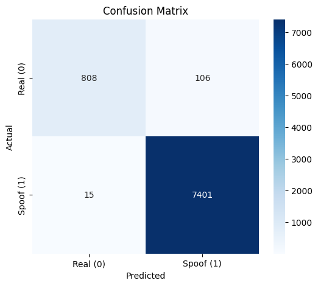

# Face Anti-Spoofing MobileNet Project

This project implements a data loading and training pipeline for Face Anti-Spoofing (classifying images as "Real" or "Spoof") using a MobileNetV3 architecture. It leverages a merged dataset strategy to achieve better class balance and diversity.

##  Project Goal
Train a robust MobileNet model to detect spoofing attacks (e.g., printed photos, screen replays) by combining multiple datasets and applying advanced data augmentation.

##  Dataset Strategy: Merging LCC_FASD & SiW
We analyzed two datasets and found them individually imbalanced:
*   **LCC_FASD**: Heavily skewed towards **Spoof** (~1:7 Real:Spoof).
*   **SiW**: Heavily skewed towards **Real** (~4:1 Real:Spoof).

**Solution**: By merging them, we achieved a highly balanced Training set:
*   **Training Samples**: ~14,385
*   **Class Ratio**: ~1.36 **Spoof** : 1 **Real**

| Split | Real Count | Spoof Count | Ratio (Spoof:Real) |
| :--- | :--- | :--- | :--- |
| **Train** | 6,099 | 8,286 | **1.36 : 1** |
| **Val** | 1,005 | 2,693 | 2.68 : 1 |
| **Test** | 914 | 7,416 | 8.11 : 1 |

##  Code Structure

### 1. `dataset.py`
Contains the custom `AntiSpoofDataset` class.
*   **Inputs**: Paths to LCC_FASD and SiW roots, `split` ('train', 'val', 'test').
*   **Logic**: Automatically navigates the directory structures of both datasets and merges them based on the requested split.
*   **Labels**: `0` for Real, `1` for Spoof.
*   **Augmentation**: Uses `albumentations` for high-performance image transformations.
    *   **Train**: Resize(224), HorizontalFlip, RandomBrightnessContrast, ShiftScaleRotate, Normalize.
    *   **Val/Test**: Resize(224), Normalize (Mean/Std).

### 2. `demo_dataset.ipynb`
A Jupyter notebook to verify and visualize the data pipeline.
*   **visualize**: Shows random batches of images.
*   **verify**: Displays augmented samples vs. clean validation samples.
*   **analyze**: Calculates and plots the class distribution for all three splits.

### 3. `test_dataset.py`
A simple unit test script to verify `AntiSpoofDataset` functionality (shape consistency, loading speed).

### 4. `training.ipynb`
The main training notebook implementing the logic to fine-tune MobileNetV3.
*   **Model**: Loads a pretrained `MobileNetV3-Large` and modifies the final classification layer for binary output (Real vs. Spoof).
*   **Training Loop**: Implements a standard PyTorch training loop with:
    *   **Loss**: `BCEWithLogitsLoss` (Binary Cross Entropy).
    *   **Optimizer**: Adam (`lr=0.001`).
    *   **Checkpointing**: Saves the model with the best validation accuracy.
*   **Evaluation**: Reports Test Set accuracy and metrics after training.

##  Results

After training the MobileNetV3 model, we evaluated it on the **Test Set** (8,330 samples).

### Confusion Matrix

### Performance Metrics
Based on the confusion matrix above:

*   **Total Samples**: 8,330
*   **Accuracy**: **98.55%**  (8,209 / 8,330)
*   **Real Class (0)**:
    *   Precision: 98.18%
    *   Recall: 88.40%  (106 misclassified as Spoof)
*   **Spoof Class (1)**:
    *   Precision: 98.59%
    *   Recall: 99.80%  (Only 15 misclassified as Real)

The model shows excellent performance, with a particularly high recall for spoofing attacks (99.8%), which is critical for security applications.

###  Authors : 

